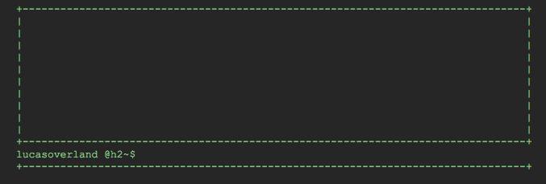

# Node ~~terminal~~ *stdin* emulator

### This is a dumb thing.

Based on [this codepen pen](http://codepen.io/overlandandseas/pen/YPBjaj). It already knows your name and tries to execute processes based on what you typed in. This is built on electron and executes the node command `execSync` every time you enter something. It does not display if the process exited without returning 0. There is a max buffer size that will kill the process if too much data is being received, however trying to us this like a terminal, so opening up vim or nano will break it.

## Commands
+ `clear` clears the screen

## Installation
`npm install`

## Run
`npm start`

## Build  
not in yet

## License
[here](../master/LICENSE)
